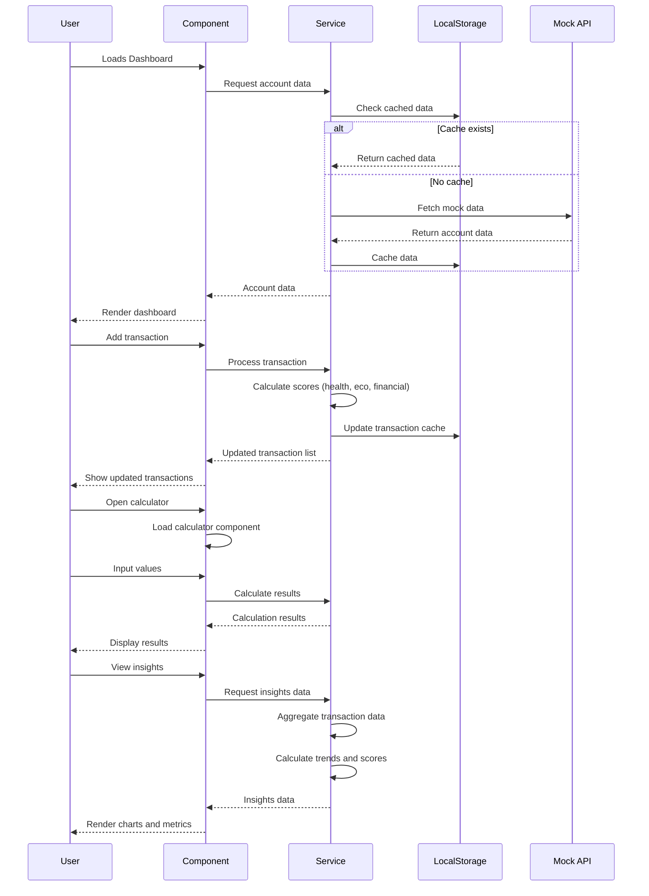
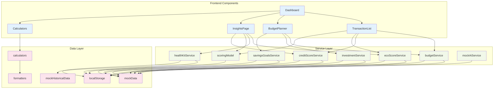
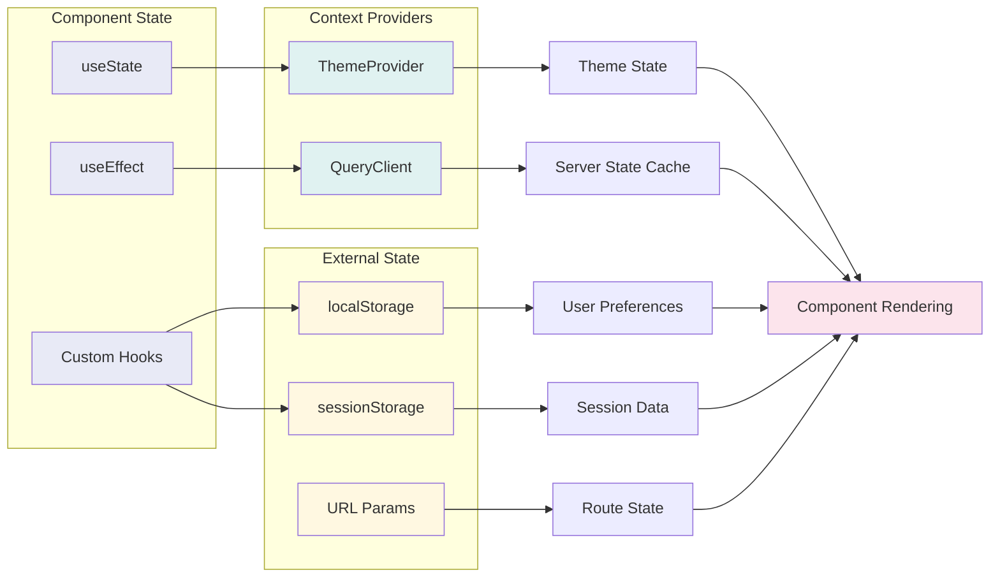
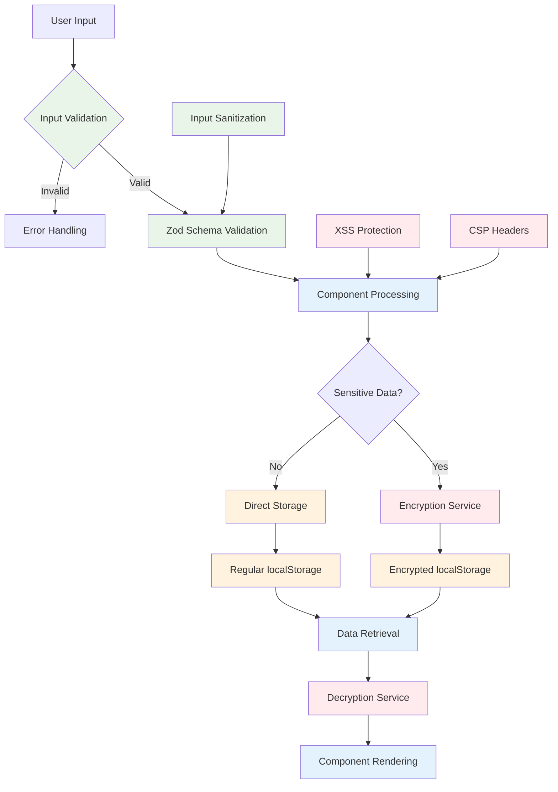
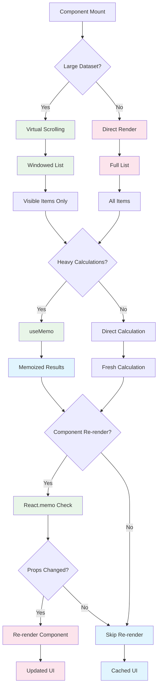
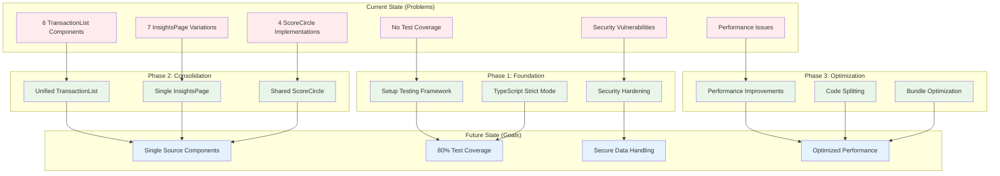

# Architecture Diagrams

This document contains system architecture diagrams for the Liquid Spark Finance application.

## Component Hierarchy Diagram

```mermaid
graph TD
    A[App.tsx] --> B[AppShell]
    A --> C[Router]
    
    B --> D[LiquidGlassTopMenuBar]
    B --> E[Navigation]
    B --> F[ThemeToggle]
    
    C --> G[Dashboard]
    C --> H[TransactionsPage]
    C --> I[BudgetPage]
    C --> J[InsightsPage]
    C --> K[CalculatorsPage]
    C --> L[InvestmentsPage]
    
    G --> M[BalanceCard]
    G --> N[QuickActions]
    G --> O[TransactionList]
    G --> P[AccountCard]
    
    H --> O
    H --> Q[TransactionStatus]
    H --> R[TransactionAmount]
    H --> S[ScoreCircles]
    
    I --> T[BudgetPlannerPage]
    T --> U[CategoryBudgets]
    T --> V[BudgetAlerts]
    T --> W[BudgetProgress]
    
    J --> X[InsightsComponents]
    X --> Y[CategoryTrendsChart]
    X --> Z[SpendingTrendsChart]
    X --> AA[MetricCard]
    X --> BB[EcoScore]
    X --> CC[HealthScore]
    
    K --> DD[CalculatorList]
    DD --> EE[CompoundInterestCalculator]
    DD --> FF[LoanCalculator]
    DD --> GG[MortgagePayoffCalculator]
    DD --> HH[FinancialFreedomCalculator]
    DD --> II[ROICalculator]
    DD --> JJ[HomeAffordabilityCalculator]
    DD --> KK[InflationCalculator]
    DD --> LL[Retirement401kCalculator]
    DD --> MM[ThreeFundPortfolioCalculator]
    DD --> NN[StockBacktestCalculator]
    DD --> OO[ExchangeRateCalculator]
    DD --> PP[InvestmentTrackerPage]
    
    L --> QQ[InvestmentTrackerPage]
    QQ --> RR[PortfolioOverview]
    QQ --> SS[PerformanceMetrics]
    QQ --> TT[GoalTracking]
    
    classDef pageClass fill:#e1f5fe
    classDef componentClass fill:#f3e5f5
    classDef calculatorClass fill:#e8f5e8
    classDef serviceClass fill:#fff3e0
    
    class G,H,I,J,K,L,T,QQ pageClass
    class M,N,O,P,Q,R,S,U,V,W,X,Y,Z,AA,BB,CC,RR,SS,TT componentClass
    class DD,EE,FF,GG,HH,II,JJ,KK,LL,MM,NN,OO,PP calculatorClass
```

## Data Flow Sequence Diagram

## Service Layer Architecture

## State Management Flow

## Security Architecture

## Performance Optimization Flow

## Refactoring Strategy Overview

