# Repository Structure Map

This document provides a comprehensive visual map of the liquid-spark-finance repository structure using Mermaid flowcharts.

## Directory Structure Overview

```mermaid
flowchart TD
    root[liquid-spark-finance/]
    root --> src[src/]
    root --> docs[docs/]
    root --> public[public/]
    root --> e2e[e2e/]
    
    %% Source Directory Structure
    src --> app[app/]
    src --> components[components/]
    src --> features[features/]
    src --> navigation[navigation/]
    src --> pages[pages/]
    src --> shared[shared/]
    src --> hooks[hooks/]
    src --> context[context/]
    src --> services[services/]
    src --> theme[theme/]
    src --> test[test/]
    src --> mocks[mocks/]
    src --> utils[utils/]
    src --> types[types/]
    
    %% App Subdirectory
    app --> appStyles[styles/]
    appStyles --> liquidGlass[liquid-glass.css]
    appStyles --> accessibility[accessibility.css]
    appStyles --> responsive[responsive-enhancements.css]
    
    %% Components Structure
    components --> ui[ui/]
    components --> ai[ai/]
    components --> layout[layout/]
    components --> shared_comp[shared/]
    components --> performance[performance/]
    components --> viewport[viewport/]
    
    %% Features - PFM Gap-10 Implementation
    features --> accounts[accounts/]
    features --> advisorChat[advisor-chat/]
    features --> ageOfMoney[age-of-money/]
    features --> analytics[analytics/]
    features --> bankLinking[bank-linking/]
    features --> billNegotiation[bill-negotiation/]
    features --> biometricIntervention[biometric-intervention/]
    features --> budget[budget/]
    features --> calculators[calculators/]
    features --> credit[credit/]
    features --> dashboard[dashboard/]
    features --> insights[insights/]
    features --> investments[investments/]
    features --> planning[planning/]
    features --> privacyHideAmounts[privacy-hide-amounts/]
    features --> safeToSpend[safe-to-spend/]
    features --> savings[savings/]
    features --> sharedBudgets[shared-budgets/]
    features --> smartSavings[smart-savings/]
    features --> subscriptions[subscriptions/]
    features --> transactions[transactions/]
    features --> widgets[widgets/]
    
    %% Feature Structure Pattern (using accounts as example)
    accounts --> accountsApi[api/]
    accounts --> accountsComponents[components/]
    accounts --> accountsHooks[hooks/]
    accountsApi --> accountService[accountService.ts]
    accountsComponents --> accountCard[AccountCard.tsx]
    accountsComponents --> accountLinking[AccountLinking.tsx]
    accountsComponents --> quickAccess[QuickAccessRail.tsx]
    
    %% Navigation System
    navigation --> navComponents[components/]
    navigation --> navHooks[hooks/]
    navigation --> navContext[context/]
    navigation --> navUtils[utils/]
    navComponents --> adaptiveNav[AdaptiveNavigation.tsx]
    navComponents --> bottomNav[BottomNav.tsx]
    navComponents --> topBar[TopBar.tsx]
    navComponents --> ios26Nav[iOS26NavBar.tsx]
    
    %% Shared Infrastructure
    shared --> sharedUI[ui/]
    shared --> sharedHooks[hooks/]
    shared --> sharedLib[lib/]
    shared --> sharedTypes[types/]
    shared --> sharedUtils[utils/]
    sharedUI --> charts[charts/]
    sharedUI --> glassComponents[LiquidGlass.tsx]
    sharedUI --> unifiedCard[UnifiedCard.tsx]
    charts --> graphBase[GraphBase.tsx]
    charts --> areaChart[AreaChart.tsx]
    charts --> lineChart[LineChart.tsx]
    
    %% Documentation Structure
    docs --> guides[guides/]
    docs --> reports[reports/]
    docs --> changelogs[changelogs/]
    docs --> adr[adr/]
    docs --> archivedConfigs[archived_configs/]
    
    guides --> implementationGuide[guide-implementation-guide.md]
    guides --> liquidGlassGuide[guide-liquid-glass-usage.md]
    guides --> migrationGuide[guide-migration-guide.md]
    
    reports --> agentLogs[Various implementation reports]
    reports --> securityReport[report-security-audit-report.md]
    reports --> refactorReport[report-ui-refactor-completion-summary.md]
    
    %% Public Assets
    public --> branding[branding/]
    public --> favicon[favicon.ico]
    public --> manifest[manifest.json]
    branding --> vueniLogo[vueni-logo.svg]
    branding --> brandGuidelines[brand-guidelines.pdf]
    
    %% E2E Test Structure
    e2e --> navigationTests[Navigation Tests]
    e2e --> performanceTests[Performance Tests]
    e2e --> responsiveTests[Responsive Tests]
    e2e --> featureTests[Feature Tests]
    e2e --> securityTests[Security Tests]
    
    navigationTests --> adaptiveNavTest[adaptive-navigation.spec.ts]
    navigationTests --> comprehensiveNavTest[comprehensive-responsive-navigation.spec.ts]
    navigationTests --> ios26Test[ios26-navbar.spec.ts]
    
    performanceTests --> performanceVitals[performance-vitals.spec.ts]
    performanceTests --> hookValidation[performance-hook-validation.spec.ts]
    performanceTests --> chartPerformance[desktop-chart-performance.spec.ts]
    
    responsiveTests --> mobileValidation[mobile-ui-validation.spec.ts]
    responsiveTests --> responsiveOverhaul[responsive-overhaul-validation.spec.ts]
    responsiveTests --> tabletQuickAccess[tablet-quick-access.spec.ts]
    
    featureTests --> analyticsTests[analytics-bulletproof.spec.ts]
    featureTests --> calculatorTests[financial-calculators.spec.ts]
    featureTests --> transactionTests[transactions.spec.ts]
    featureTests --> biometricsTests[biometrics-unification.spec.ts]
    
    securityTests --> securitySpec[security.spec.ts]
    securityTests --> whiteScreenDebug[white-screen-debug.spec.ts]
    
    %% Styling
    classDef featureBox fill:#e1f5fe,stroke:#01579b,stroke-width:2px
    classDef systemBox fill:#f3e5f5,stroke:#4a148c,stroke-width:2px
    classDef testBox fill:#e8f5e8,stroke:#1b5e20,stroke-width:2px
    classDef docsBox fill:#fff3e0,stroke:#e65100,stroke-width:2px
    
    class accounts,advisorChat,ageOfMoney,analytics,bankLinking,billNegotiation,biometricIntervention,budget,calculators,credit,dashboard,insights,investments,planning,privacyHideAmounts,safeToSpend,savings,sharedBudgets,smartSavings,subscriptions,transactions,widgets featureBox
    class navigation,shared,components,theme,services systemBox
    class e2e,navigationTests,performanceTests,responsiveTests,featureTests,securityTests testBox
    class docs,guides,reports,changelogs,adr docsBox
```

## PFM Gap-10 Features Overview

The application implements the complete PFM Gap-10 feature set:

### Core Financial Features
- **Accounts Management** - Account linking, overview, and management
- **Transactions** - Transaction processing, categorization, and analysis
- **Budget Tracking** - Budget planning, tracking, and reporting
- **Credit Monitoring** - Credit score tracking and improvement tips
- **Investment Tracking** - Portfolio management and allocation

### Advanced PFM Features
- **Bank Linking** - Secure bank account integration
- **Subscriptions Management** - Recurring payment tracking and management
- **Bill Negotiation** - Automated bill negotiation services
- **Smart Savings** - Intelligent savings automation
- **Safe to Spend** - Real-time spending recommendations
- **Age of Money** - Cash flow timing analysis
- **Shared Budgets** - Family/household budget management
- **Privacy Controls** - Amount hiding and privacy features
- **Widgets System** - Customizable dashboard widgets
- **AI Advisor Chat** - Financial advice and guidance

### Health & Wellness Integration
- **Biometric Intervention** - Health data integration for spending insights
- **Analytics Dashboard** - Comprehensive financial and health analytics
- **Wellness Scoring** - Combined financial and health metrics

### User Experience Features
- **Responsive Design** - Mobile-first, adaptive UI
- **Liquid Glass Design System** - Modern glass morphism UI
- **Accessibility** - WCAG compliant interface
- **Performance Optimization** - Optimized for mobile and desktop
- **Quick Access Rails** - Fast navigation and actions

## Key Technologies

- **Frontend**: React + TypeScript + Vite
- **Styling**: Tailwind CSS + Liquid Glass Design System
- **State Management**: Zustand
- **Charts**: Custom GraphBase implementation
- **Testing**: Playwright (E2E) + Vitest (Unit)
- **Build**: Vite with performance optimizations
- **Navigation**: Custom adaptive navigation system

## Architecture Highlights

1. **Feature-Based Architecture** - Each PFM feature is self-contained with its own API, components, hooks, and store
2. **Shared Infrastructure** - Common UI components, hooks, and utilities are shared across features
3. **Responsive Navigation** - Adaptive navigation system that works across all screen sizes
4. **Performance Optimization** - Lazy loading, virtualization, and performance monitoring
5. **Security First** - Comprehensive security measures and testing
6. **Accessibility Compliance** - Full WCAG compliance with extensive testing

This structure supports a scalable, maintainable personal finance management application with advanced features and excellent user experience.