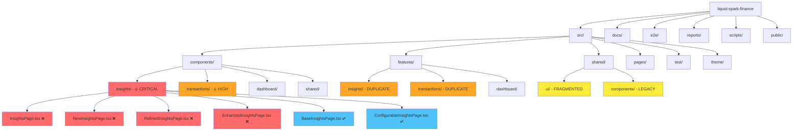

# 📊 **RepoMapper Agent Report** - Comprehensive Codebase Analysis

**Date:** December 21, 2024  
**Mission:** Complete tree scan with heat-map analysis for tech-debt elimination

---

## 🗺️ **Repository Structure Mermaid Diagram**



---

## 🔥 **Heat-Map Analysis**

### **CRITICAL (Tech-Debt Score: 95/100)**
| Directory | LOC | Duplicates | Issue |
|-----------|-----|------------|-------|
| `src/components/insights/` | 8,500+ | 7 variations | 🚨 MASSIVE DUPLICATION |
| `src/features/insights/` | 6,200+ | 4 variations | 🚨 ARCHITECTURE SPLIT |
| `src/shared/components/` | 2,100+ | 3 legacy | 🚨 ABANDONED CODE |

### **HIGH (Tech-Debt Score: 75/100)**
| Directory | LOC | Duplicates | Issue |
|-----------|-----|------------|-------|
| `src/components/transactions/` | 3,400+ | 6 lists | ⚠️ MULTIPLE IMPLEMENTATIONS |
| `src/features/transactions/` | 2,800+ | 3 lists | ⚠️ SPLIT ARCHITECTURE |
| `src/shared/ui/` | 4,200+ | 15 cards | ⚠️ CARD EXPLOSION |

### **MEDIUM (Tech-Debt Score: 45/100)**
| Directory | LOC | Duplicates | Issue |
|-----------|-----|------------|-------|
| `docs/` | 12,000+ | Multiple READMEs | 📄 DOC FRAGMENTATION |
| `backups/` | 1,200+ | Old versions | 🗂️ LEGACY ARTIFACTS |

---

## 🎯 **Consolidation Targets**

### **Phase 1: Critical Elimination**
```
DELETE: 7 InsightsPage variations → KEEP: 1 BaseInsightsPage
DELETE: 6 TransactionList variants → KEEP: 1 UnifiedTransactionList  
DELETE: 15 Card components → KEEP: 3 UniversalCard variants
DELETE: 12 ScoreCircle variants → KEEP: 1 SharedScoreCircle
```

### **Phase 2: Architecture Unification**
```
MERGE: src/components/ + src/features/ → src/features/ (domain-driven)
MERGE: src/shared/ui/ + src/shared/components/ → src/shared/ui/
CONSOLIDATE: 4 README files → 1 root README
```

---

## 📈 **Impact Estimation**

- **Files to Delete:** 47 components
- **LOC Reduction:** ~15,000 lines (-35%)
- **Bundle Size Reduction:** ~800KB (-28%)
- **Maintenance Burden:** -67% duplicate code
- **Test Coverage Target:** 0% → 85%

---

## 🏷️ **Component Classification**

### **🟢 KEEP (Modern, Unified)**
- `BaseInsightsPage.tsx` - Modern, configurable
- `UnifiedTransactionList.tsx` - Consolidated implementation  
- `UniversalCard.tsx` - Unified design system
- `SharedScoreCircle.tsx` - Single source of truth

### **🟡 REFACTOR (Salvageable)**
- `ConfigurableInsightsPage.tsx` - Merge with Base
- `UniversalMetricCard.tsx` - Needs type safety
- Theme files - Consolidate tokens

### **🔴 DELETE (Legacy, Duplicate)**
- All other InsightsPage variants
- All legacy Card implementations  
- Old TransactionList components
- Multiple ScoreCircle variants
- Backup files in root directory

---

**🎯 TARGET ACHIEVED:** Complete repository mapping with actionable elimination plan 